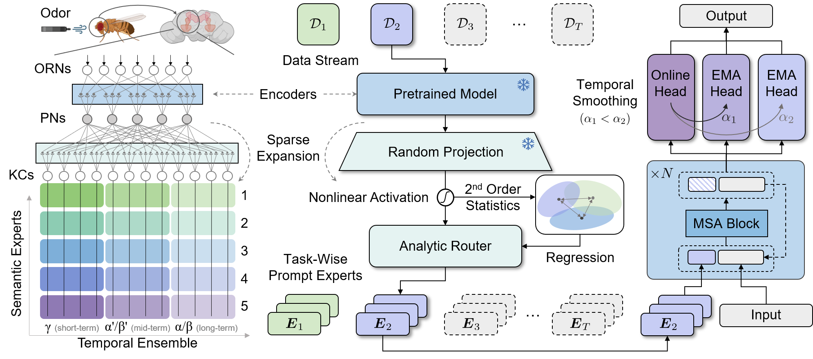

# FlyGCL: Lightweight Continual Learning Framework (FlyPrompt & ViT baselines)

<p align="center">
  <a href="https://www.arxiv.org/abs/2602.01976"></a>
  <a href="https://huggingface.co/HoraceYan/FlyGCL"></a>
  <a href="https://github.com/AnAppleCore/FlyGCL"></a>
  <a href="https://hits.sh/github.com/AnAppleCore/FlyGCL/"></a>
  <a href="LICENSE"></a>
  <a href="https://github.com/AnAppleCore/FlyGCL/commits/main"></a>
</p>

FlyGCL is a practical framework for **General Continual Learning (GCL) / online class-incremental learning** on images, with a focus on the **Si-Blurry** setting. It includes multiple pretrained-based baselines built on Vision Transformers (ViT) and a lightweight runner for reproducing experiments. **FlyPrompt** is our proposed method, which uses random-expanded routing and temporal-ensemble experts to effectively tackle GCL problem, achieving significant gains on major benchmarks.

<p align="center">
  
</p>

## 📦 What's included

- **Methods**: `flyprompt` (ours), `l2p`, `dualprompt`, `codaprompt`, `mvp`, `misa`, `slca`, `sprompt`, `ranpac`, `hide` (prompt/lora/adapter), `norga`, `sdlora`
- **Backbones**: ViT via `timm` and a local ViT implementation (`models/vit.py`) supporting multiple pretrained sources
- **Setting**: true online Si-Blurry with configurable disjoint/blurry ratios
- **Outputs**: logs and numpy/json artifacts under `results/`

## 🛠️ Installation (Linux)

### Python environment

- **Python**: 3.10+
- **PyTorch / CUDA**: please follow the official PyTorch instructions for your CUDA version, and then install the remaining dependencies.

We recommend:

```bash
python -m venv .venv
source .venv/bin/activate
pip install -U pip
pip install -r requirements.txt
```

Notes:

- `requirements.txt` pins a full stack (including `torch/torchvision`). If you prefer installing PyTorch from a specific CUDA wheel index, install PyTorch first and then install the remaining packages accordingly.

## 🗂️ Datasets

FlyGCL uses `--data_dir` as the **dataset root path**. Different datasets expect different sub-structures (please see below).

### Recommended directory layout

```text
FlyGCL/
  data/                          # default ./data
    CIFAR/                       # for CIFAR-10/100 (torchvision)
    imagenet-r/                  # for ImageNet-R (see split requirement below)
      train/
        <class_name>/*.jpg
      test/
        <class_name>/*.jpg
    CUB_200_2011/                # for CUB-200-2011
      images/
        <class_name>/*.jpg
```

You may change the root path by:

- **CLI**: `--data_dir /your/path`
- **Baseline scripts**: set `DATA_ROOT=/your/path` (scripts use `${DATA_ROOT}/CIFAR`, `${DATA_ROOT}/imagenet-r`, `${DATA_ROOT}/CUB_200_2011` by default)

### Download links (common benchmarks)

- **CIFAR-100**: torchvision can download automatically. Official page: `https://www.cs.toronto.edu/~kriz/cifar.html`
- **ImageNet-R (Rendition)**:
  - Project page: `https://github.com/hendrycks/imagenet-r`
  - Tarball (as referenced in our dataset code comments): `https://people.eecs.berkeley.edu/~hendrycks/imagenet-r.tar`
  - **Note**: our active loader expects `imagenet-r/train/` and `imagenet-r/test/`. If your download does not include this split, please create a split (e.g., 80/20 per class) and place images into `train/` and `test/` folders.
- **CUB-200-2011**:
  - Official page: `https://www.vision.caltech.edu/datasets/cub_200_2011/`
  - Direct tgz (images+annotations): `https://data.caltech.edu/records/65de6-vp158/files/CUB_200_2011.tgz`
  - After extraction, point `--data_dir` to the extracted `CUB_200_2011/` folder (the one that contains `images/`).

### Notes on `download=True`

The trainer currently calls dataset constructors with `download=True`, but **most custom datasets in `datasets/` have download/extract code commented out**. In practice:

- **CIFAR-10/100** (torchvision) can auto-download into `--data_dir`.
- Many others (e.g., ImageNet-R, CUB, Cars) require **manual download + correct folder structure**.

## 🧩 Checkpoints (pretrained backbones & prompt checkpoints)

Checkpoint download links:

- **Hugging Face**: [Hugging Face Project](https://huggingface.co/HoraceYan/FlyGCL)
- **Baidu Netdisk**: [Download Link](https://pan.baidu.com/s/14Cf83kIrx3grjMSuPlAV5g?pwd=39wb) (code: `39wb`)

### Where to put files

Please create a local folder:

```text
FlyGCL/
  checkpoints/
    (files listed below)
```

Notes:

- `checkpoints/` is ignored by git (`.gitignore`), so you should download and place files manually.
- `models/vit.py` will also look for some `.npz` weights under `~/.cache/torch/hub/checkpoints/` (torch hub cache, for `vit_base_patch16_224`).

### Supported local backbone checkpoints (ViT-B/16)

When you set `--backbone` to one of the following, `models/vit.py` will try to load a local file when `pretrained=True`:

`run.sh` also uses `vit_base_patch16_224` by default, which requires to put `ViT-B_16.npz` weights under `~/.cache/torch/hub/checkpoints/`.

| Model Name  | `--backbone` value                 | Expected file name                                |
| ----------- | ---------------------------------- | ------------------------------------------------- |
| Sup-21K     | `vit_base_patch16_224`             | `ViT-B_16.npz`                                    |
| Sup-21K/1K  | `vit_base_patch16_224_mepo_21k_1k` | `vit_21k_1k_mepo_epoch_0.pth`                     |
| iBOT-21K    | `vit_base_patch16_224_21k_ibot`    | `checkpoint.pth` (expects key `teacher`)          |
| iBOT-1K     | `vit_base_patch16_224_ibot`        | `ibot_vitbase16_pretrain.pth`                     |
| DINO-1K     | `vit_base_patch16_224_dino`        | `dino_vitbase16_pretrain.pth`                     |
| MoCo v3-1K  | `vit_base_patch16_224_mocov3`      | `mocov3-vit-base-300ep.pth` (expects key `model`) |

### Prompt checkpoints (MISA)

`MISA` (based on `DualPrompt`) loads prompt tensors from local files when you pass `--load_pt`:

- `./checkpoints/g_prompt.pt`
- `./checkpoints/e_prompt.pt`

Prompt checkpoints are distributed via the same links above.

## 🚀 Quick start (FlyPrompt)

Single-GPU, CIFAR-100, Si-Blurry (n=50, m=10), 5 tasks:

```bash
python main.py \
  --method flyprompt \
  --dataset cifar100 \
  --data_dir ./data/CIFAR \
  --backbone vit_base_patch16_224 \
  --n_tasks 5 --n 50 --m 10 \
  --batchsize 64 --lr 0.005 \
  --online_iter 3 --num_epochs 1 \
  --use_amp --eval_period 1000 \
  --note flyprompt_cifar100
```

ImageNet-R example (requires `./data/imagenet-r/train` and `./data/imagenet-r/test`):

```bash
python main.py \
  --method flyprompt \
  --dataset imagenet-r \
  --data_dir ./data/imagenet-r \
  --backbone vit_base_patch16_224 \
  --n_tasks 5 --n 50 --m 10 \
  --batchsize 32 --lr 0.005 \
  --online_iter 3 --num_epochs 1 \
  --use_amp --eval_period 1000 \
  --note flyprompt_imagenet_r
```

## 🏃 Running baseline scripts (`scripts/`)

We provide ready-to-run bash scripts under `scripts/`:

- Set **python interpreter** with env var `PYTHON` (defaults to `python`)
- Set **dataset root** with env var `DATA_ROOT` (defaults to `./data`)

Example:

```bash
export DATA_ROOT=./data
export PYTHON=python
bash scripts/run_baselines_flyprompt.sh 0 "1 2 3" cifar100 flyprompt_minimal
```

You can always override the dataset path per run by passing `--data_dir ...` as extra args:

```bash
bash scripts/run_baselines_flyprompt.sh 0 "1 2 3" cifar100 note --data_dir /mnt/datasets/CIFAR
```

### `run.sh` (multi-session runner)

`run.sh` launches many baseline scripts via `screen`. If you plan to use it, please ensure `screen` is installed.

## 🔧 Key arguments

- **Method/dataset**: `--method {flyprompt|l2p|dualprompt|codaprompt|mvp|slca|ranpac|...}` `--dataset {cifar100|imagenet-r|cub200|...}` `--data_dir /path`
- **Setting**: `--n_tasks 5` `--n 50` (disjoint class ratio, %) `--m 10` (blurry sample ratio, %)
- **Training**: `--batchsize 64` `--lr 0.005` `--online_iter 3` `--num_epochs 1` `--use_amp` `--eval_period 1000`
- **Backbone**: `--backbone vit_base_patch16_224` (or one of the local-checkpoint variants)
- **Repro**: `--seeds 1 2 3` `--note my_experiment`

## 📁 Outputs

Outputs are stored under `results/`:

```text
results/
  logs/{dataset}/{note}/
    seed_{seed}.npy
    seed_{seed}_eval.npy                 # if eval_period is enabled
    seed_{seed}_eval_time.npy            # if eval_period is enabled
```

When running via `scripts/*.sh`, the console output is additionally captured by `tee` into:

- `results/logs/{dataset}/{note}/seed_{SEEDS}_log.txt`

## 🧱 Project layout

- `main.py`: entry point (loads args, builds trainer, runs)
- `configuration/config.py`: argument definitions
- `methods/`: trainers (e.g., `methods/flyprompt.py`)
- `models/`: model components (e.g., `models/flyprompt.py`, `models/vit.py`)
- `datasets/`: dataset wrappers
- `scripts/`: baseline launchers

## 🙏 Acknowledgements

We sincerely thank the authors and maintainers of the following open-source projects and resources. Parts of this codebase are adapted from, or inspired by, them:

- [MISA](https://github.com/kangzhiq/MISA)
- [l2p-pytorch](https://github.com/JH-LEE-KR/l2p-pytorch)
- [RanPAC](https://github.com/RanPAC/RanPAC)
- [HiDe-Prompt](https://github.com/thu-ml/HiDe-Prompt)
- [MoE_PromptCL](https://github.com/Minhchuyentoancbn/MoE_PromptCL)
- [SD-Lora-CL](https://github.com/WuYichen-97/SD-Lora-CL)

## 📝 Citation

If this repository helps your research, please cite our paper:

```bibtex
@inproceedings{flyprompt2026,
  title={FlyPrompt: Brain-Inspired Random-Expanded Routing with Temporal-Ensemble Experts for General Continual Learning},
  author={Yan, Hongwei and Sun, Guanglong and Zhou, Kanglei and Li, Qian and Wang, Liyuan and Zhong, Yi},
  booktitle={ICLR},
  year={2026}
}
```

## ✉️ Contact

If you have any questions, suggestions, please feel free to report issues or contact:

- Maintainer: **Hongwei Yan** (`yanhw22@mails.tsinghua.edu.cn`)

## 📄 License

MIT. See `LICENSE`.
